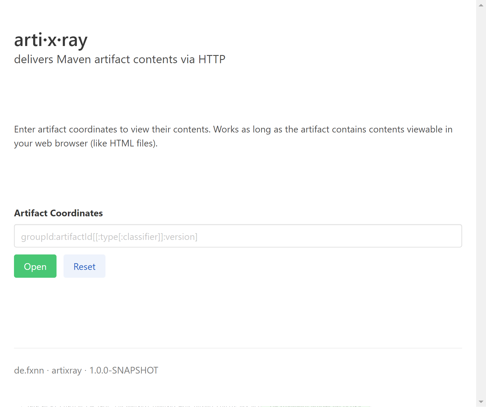

# artixray

No need to deploy your JavaDoc, HTML reports or project site to a webserver.
No need to upload it to your wiki.
Simply enter a URL, and _artixray_ cares for the rest.

This project is a web server that, upon request, instantly retrieves the requested artifact
from a Maven repository, unpacks it and displays the requested file.
All transparent to you, who simply gets served the artifact's contents.
`RELEASE` and `SNAPSHOT` version placeholders supported.

It is, however, not intended to be used as public service, as it is neither designed to be scalable,
nor secure.

[](https://github.com/fxnn/artixray/actions?query=workflow%3A%22Master+Build%22) [](https://hub.docker.com/r/fxnn/artixray)

## Usage

Run the application using Docker.
```
docker run -i --rm -p 8080:8080 fxnn/artixray:latest
```

This makes the application available at http://localhost:8080. 
It contains a minimal user interface, which should be self explanatory.



## Development  

### Build
Run a regular build using `./mvnw package`.
It produces the `artixray-1.0.0-SNAPSHOT-runner.jar` file in the `/target` directory.
Be aware that it’s not an _über-jar_ as the dependencies are copied into the `target/lib` directory.

The application is now runnable using `java -jar target/artixray-1.0.0-SNAPSHOT-runner.jar`.

### Live Coding
You can run the application in dev mode that enables live coding using:
```
./mvnw quarkus:dev
```

### Docker
Create Docker images using the Dockerfiles in `src/main/docker`.

### Related Documentation
Backend:
* [Quarkus Java framework](https://quarkus.io/guides/)
* [GitHub actions](https://help.github.com/en/actions)

Frontend:
* [Hyperapp webapp framework](https://hyperapp.dev)
* [Bulma CSS framework](https://bulma.io/documentation/)

## License
Copyright 2020 Felix Neumann

Licensed under the Apache License, Version 2.0 (the "License");
you may not use this file except in compliance with the License.
You may obtain a copy of the License at

  http://www.apache.org/licenses/LICENSE-2.0

Unless required by applicable law or agreed to in writing, software
distributed under the License is distributed on an "AS IS" BASIS,
WITHOUT WARRANTIES OR CONDITIONS OF ANY KIND, either express or implied.
See the License for the specific language governing permissions and
limitations under the License.
